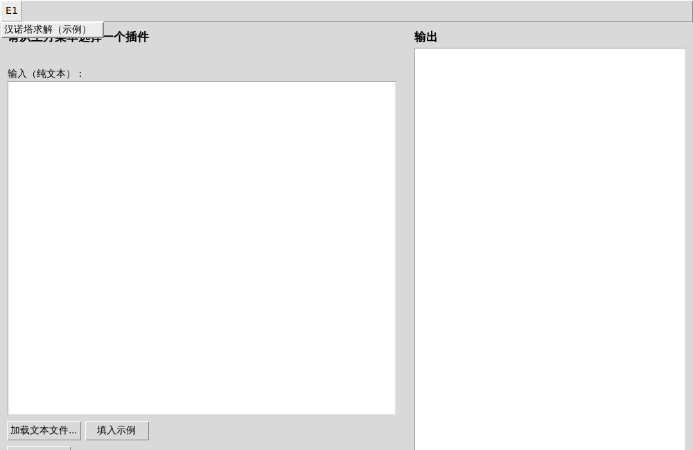
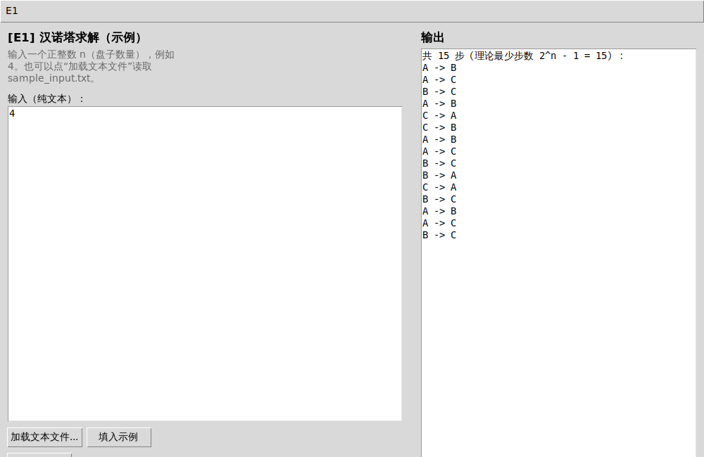

# 数据结构实验课程 —— 插件式集成平台

- 课程设计（每次课讲什么、布置什么任务、验收标准）：[`docs/course_design.md`](docs/course_design.md)
- 学生操作手册（平台使用、插件接口规范、常见问题）：[`docs/student_manual.md`](docs/student_manual.md)
- VSCode 环境配置指南（零命令行，适合初学者）：[`docs/vscode_setup.md`](docs/vscode_setup.md)
- 图文讲解页（架构图 + 快速上手 + 课程时间线）：[`docs/plugin_platform_guide.html`](docs/plugin_platform_guide.html)（下载后用浏览器打开，GitHub 网页只会显示源码不会渲染）
- Python 平台：[`platform-python/`](platform-python/)
- C 平台：[`platform-c/`](platform-c/)

两版平台均已包含 E1（递归/汉诺塔）示例插件，作为学生编写自己插件的参照实现。

## 界面预览（Python 版）

| 顶部菜单栏（按实验分组） | 运行结果 |
| --- | --- |
|  |  |

更多截图和详细操作步骤见 [`platform-python/README.md`](platform-python/README.md)。
